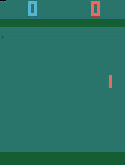
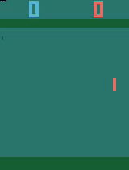
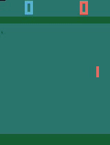

# Double DQN

This is a PyTorch implementation of [Deep Reinforcement Learning with Double Q-learning](https://arxiv.org/pdf/1509.06461.pdf).

The Reinforcement Learning agent is trained to play Atari games (ALE/Pong-v5) from pixels.


## Installation
```bash
pip install -r requirements.txt
pip install "gymnasium[atari]"

# If using Apple M1, to the following.
# AutoROM --accept-license
```

## Run
```bash
# Make adjustment to config files in config directory
python main.py --config_path ./config/base.yaml
```

## Result

### Score report


### Sampled episodes
##### Episode 1

##### Episode 10

##### Episode 100

##### Episode 1000

